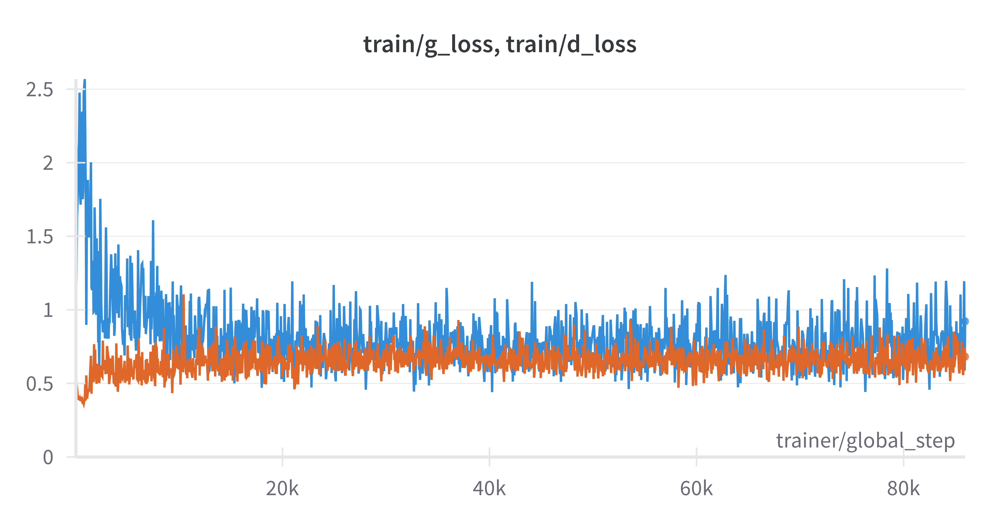

<div align="center">

# Pantheon Lab Programming Assignment

<a href="https://pytorch.org/get-started/locally/"></a>
<a href="https://pytorchlightning.ai/"></a>
<a href="https://hydra.cc/"></a>
<a href="https://github.com/ashleve/lightning-hydra-template"></a><br>

</div>

## What is all this?
This "programming assignment" is really just a way to get you used to
some of the tools we use every day at Pantheon to help with our research.

There are 4 fundamental areas that this small task will have you cover:

1. Getting familiar with training models using [pytorch-lightning](https://pytorch-lightning.readthedocs.io/en/latest/starter/new-project.html)

2. Using the [Hydra](https://hydra.cc/) framework

3. Logging and reporting your experiments on [weights and biases](https://wandb.ai/site)

4. Showing some basic machine learning knowledge

## What's the task?
The actual machine learning task you'll be doing is fairly simple! 
You will be using a very simple GAN to generate fake
[MNIST](https://pytorch.org/vision/stable/datasets.html#mnist) images.

We don't excpect you to have access to any GPU's. As mentioned earlier this is just a task
to get you familiar with the tools listed above, but don't hesitate to improve the model
as much as you can!

## What you need to do

To understand how this framework works have a look at `src/train.py`. 
Hydra first tries to initialise various pytorch lightning components: 
the trainer, model, datamodule, callbacks and the logger.

To make the model train you will need to do a few things:

- [ ] Complete the model yaml config (`model/mnist_gan_model.yaml`)
- [ ] Complete the implementation of the model's `step` method
- [ ] Implement logging functionality to view loss curves 
and predicted samples during training, using the pytorch lightning
callback method `on_epoch_end` (use [wandb](https://wandb.ai/site)!) 
- [ ] Answer some questions about the code (see the bottom of this README)

**All implementation tasks in the code are marked with** `TODO`

Don't feel limited to these tasks above! Feel free to improve on various parts of the model

For example, training the model for around 20 epochs will give you results like this:


## Getting started
After cloning this repo, install dependencies
```yaml
# [OPTIONAL] create conda environment
conda create --name pantheon-py38 python=3.8
conda activate pantheon-py38

# install requirements
pip install -r requirements.txt
```

Train model with experiment configuration
```yaml
# default
python run.py experiment=train_mnist_gan.yaml

# train on CPU
python run.py experiment=train_mnist_gan.yaml trainer.gpus=0

# train on GPU
python run.py experiment=train_mnist_gan.yaml trainer.gpus=1
```

You can override any parameter from command line like this
```yaml
python run.py experiment=train_mnist_gan.yaml trainer.max_epochs=20 datamodule.batch_size=32
```

The current state of the code will fail at
`src/models/mnist_gan_model.py, line 29, in configure_optimizers`
This is because the generator and discriminator are currently assigned `null`
in `model/mnist_gan_model.yaml`. This is your first task in the "What you need to do" 
section.

## Bonus tasks

- **Implement your own networks**: you are free to choose what you deem most appropriate, but we recommend using CNN and their variants
- Use a more complex dataset, such as Fashion-MNIST

## Questions

Try to prepare some short answers to the following questions below for discussion in the interview.

* What is the role of the discriminator in a GAN model? Use this project's discriminator as an example.
  * The discriminator is a classifier trained to distinguish between real images from training data and fake images generated by generator.

* The generator network in this code base takes two arguments: `noise` and `labels`.
What are these inputs and how could they be used at inference time to generate an image of the number 5?
  * `noise`: A random noise vector typically sampled from a normal distribution
  * `labels`: Specific labels is used for conditional GANs to direct the generator to produce data corresponding to specific classes
  * At inference time, to generate an image of 5, we need to create a random noise vector, specify label=5 and then pass both vector and the label into the generator.

* What steps are needed to deploy a model into production?
  * Host the model at some endpoint or serving, AWS Sagemaker Endpoint or Triton for example
  * Integrate the model into production system, as an API or a microservice
  * Set up dashboard to monitor the state and performance of the model once it is deployed, for example Grafana and elasticsearch

* If you wanted to train with multiple GPUs, 
what can you do in pytorch lightning to make sure data is allocated to the correct GPU? 
  * When you train with GPU using PyTorch lightning, it will assign a GPU id for each of your GPU
  * You can specify the GPU id on each training job to make sure you are using the specific GPU
  * E.g. Trainer(accelerator="gpu", devices=1) with one GPU
  * Trainer(accelerator="gpu", devices=[0, 1]) with multiple GPUs

## WANDB Graphs and Results
1. Baseline model (Original model without any change: lr: 0.00002; batch_size=32; epochs=20)
   * 
   * 
2. CNN-Based GAN (CNN-based GAN: lr: 0.00002; batch_size=32; epochs=50)
   * 
   * 
3. CNN-Based GAN on FashionMINST (CNN-based GAN: lr: 0.0002; batch_size=256; epochs=45)
   * 
   * 

    ### Challenge & Solution
    * The challenge I encountered is to balance the learning progress of discriminator and generator.
      * If the discriminator learn too fast, it will recognize all the faked images from the generator. This will destroy the generator, making the gen loss diverge and the generator create noise again.
      * If the discriminator learn too slow, it will fail on recognizing any images and allow the gen loss converging so fast without learning anything.
      * Unless the discriminator learning rate is too low, most of the time I can see the gen loss is diverging.
    * This problem appears seriously especially on MNIST problem. I think it's because the MNIST dataset is simpler so the discriminator is learning too fast.
    * To slow down the discriminator learning process, I tried to lower the discriminator learning rate.
      * For the FashionMNIST, it works quite well when I lower the discriminator learning rate by 10-100.
      * However, it is much more challenging for MNIST training, simply lowering the discriminator learning rate is not enough.
        * I consider the discriminator is probably overfitting because it notices the real images is a matrix of numbers of the form n/255.
        * I added Gaussian noise to the discriminator input, trying to remove this "trick" from the discriminator.
        * After the little tweak, sometimes I can see both the generator and discriminator converge in the middle, and then the gen loss increase again. This means the training is finished and no further improvement will be made in the generator.
        * It is because when the disc loss drop to a very low value (0.1-0.2), it is very strong at recognizing the fake images generated by the generator, at this point we should focus on how good the generated images are by looking at them directly.
        * But it still implies the discriminator overpowers generator at some point, I found that adding more dropout layers in the discriminator helps stabilize the loss curve.
        * Experiment with different setting on the discriminator helps improve the whole output.

## Submission

- Using git, keep the existing git history and add your code contribution on top of it. Follow git best practices as you see fit. We appreciate readability in the commits
- Add a section at the top of this README, containing your answers to the questions, as well as the output `wandb` graphs and images resulting from your training run. You are also invited to talk about difficulties you encountered and how you overcame them
- Link to your git repository in your email reply and share it with us/make it public

<br>
